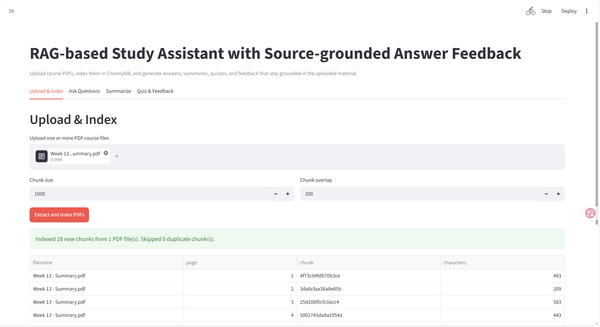
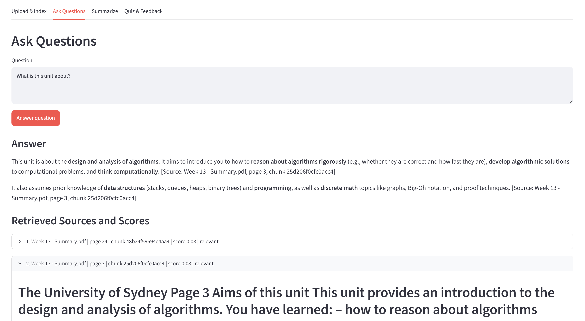
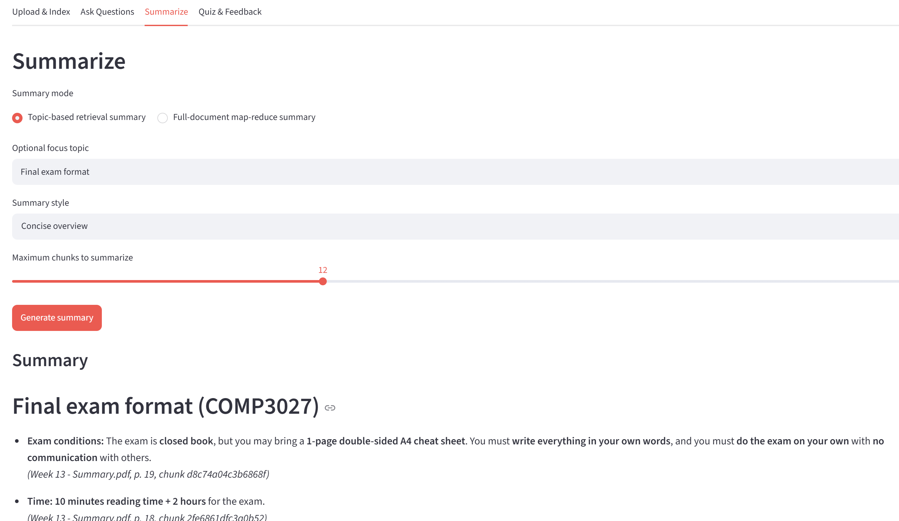
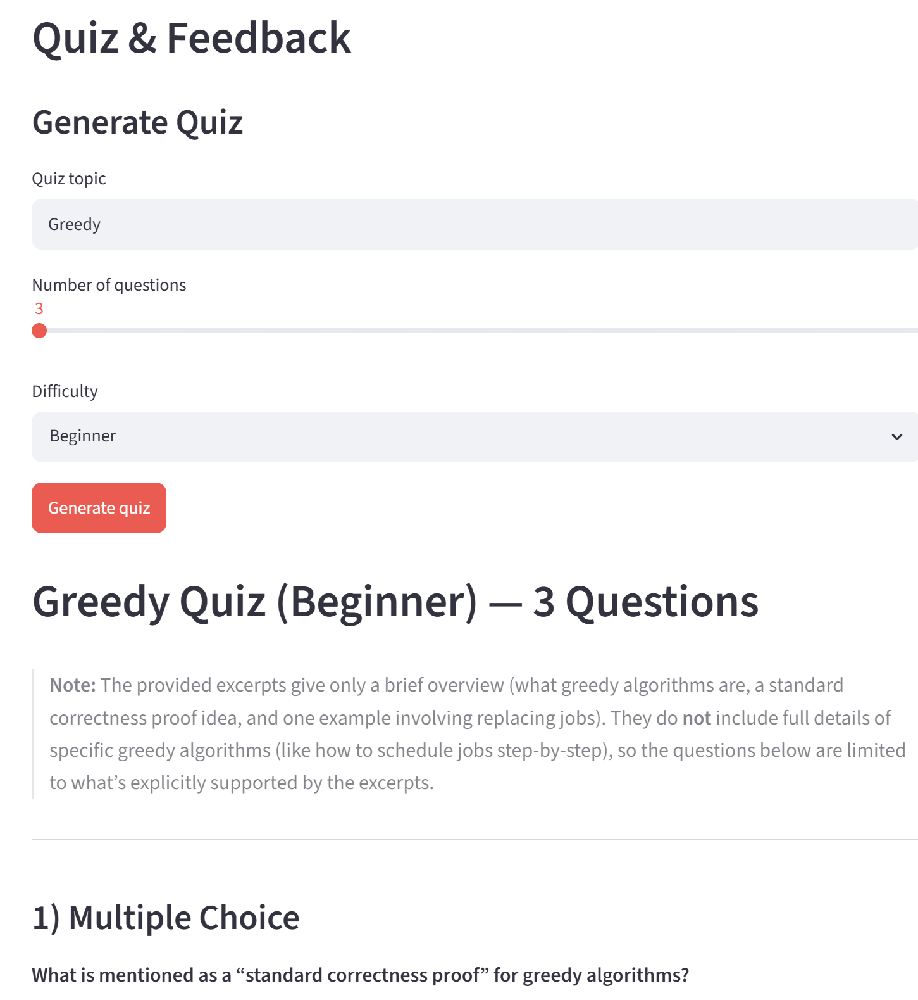
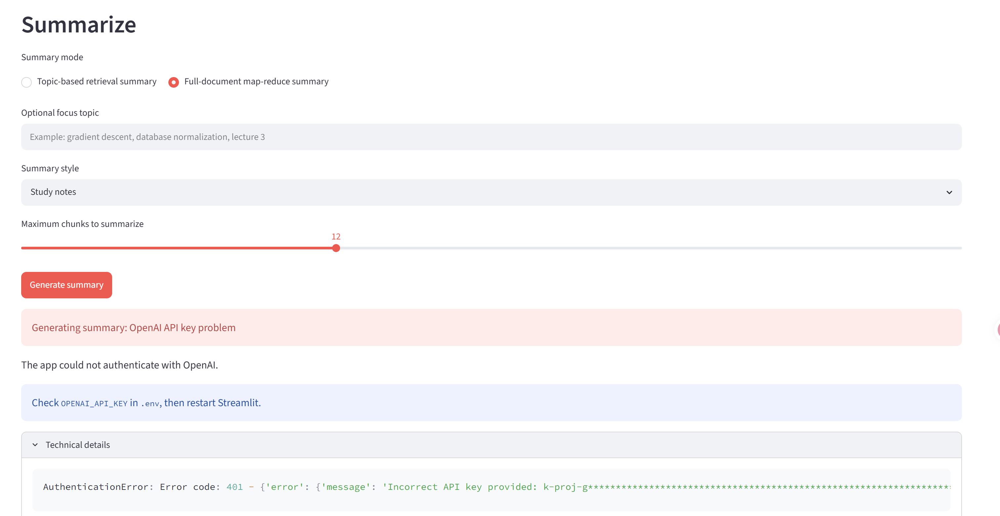

# RAG-based Study Assistant with Source-grounded Answer Feedback

## Project Overview

RAG-based Study Assistant with Source-grounded Answer Feedback is a Streamlit prototype for studying from uploaded PDF course materials. Users can upload PDFs, index the content into a local ChromaDB vector database, ask questions, generate summaries, create quizzes, and receive feedback on student answers with source snippets and page references. The goal is not to build a production chatbot, but to prototype a source-grounded learning assistant and explore how retrieval quality, evidence visibility, and structured feedback affect the reliability of LLM-generated educational support.

This project demonstrates a practical Retrieval-Augmented Generation (RAG) workflow using Python, LangChain, ChromaDB, PyMuPDF, and the OpenAI API.

Important: This is a prototype, not a production system. It is designed as a learning and portfolio project. It does not include production-grade security, authentication, multi-user isolation, monitoring, OCR, robust evaluation, or deployment hardening.

## Key Features

- Upload one or more PDF course files.
- Extract page-level text from PDFs using PyMuPDF.
- Split extracted text into overlapping chunks.
- Generate embeddings with OpenAI embeddings.
- Store chunks in persistent ChromaDB with metadata:
  - filename
  - page number
  - chunk index
  - chunk hash
  - stable chunk id
- Prevent duplicate indexing when the same PDF is uploaded again.
- Retrieve relevant chunks with relevance scores.
- Display source snippets, page references, chunk ids, and retrieval scores.
- Answer user questions using only retrieved PDF content.
- Use a relevance threshold to answer cautiously or refuse when retrieved evidence is insufficient.
- Generate topic-based summaries using retrieved chunks.
- Generate full-document summaries with a map-reduce style workflow.
- Generate quiz questions based on retrieved course material.
- Provide structured feedback on student answers, including:
  - correct points
  - missing concepts
  - incorrect or unsupported claims
  - suggested improved answer
  - relevant sources
- Show user-friendly Streamlit errors for API key, model, quota, network, and ChromaDB issues.
- Include basic automated tests for PDF extraction, chunk metadata, retrieval behavior, prompt formatting, and UI-safe error formatting.

## Tech Stack

- Python
- Streamlit
- LangChain
- ChromaDB
- OpenAI API
- PyMuPDF
- python-dotenv

Main LangChain packages:

- `langchain`
- `langchain-core`
- `langchain-openai`
- `langchain-chroma`
- `langchain-text-splitters`

## RAG Pipeline

```text
PDF upload
   |
   v
Page-level text extraction with PyMuPDF
   |
   v
Text chunking with overlap
   |
   v
Stable chunk id + metadata creation
   |
   v
OpenAI embedding generation
   |
   v
ChromaDB vector storage
   |
   v
Question / topic / student answer input
   |
   v
Vector retrieval with relevance scores
   |
   v
Prompt construction with source snippets
   |
   v
OpenAI answer / summary / quiz / feedback generation
   |
   v
Streamlit display with answer, sources, pages, snippets, and scores
```

The app keeps the generated responses source-grounded by passing only retrieved PDF snippets into the prompt. If retrieved evidence is weak or limited, the answer should mention that the source evidence may be incomplete.

## Screenshots

### Upload and Index



### Question Answering with Sources



### Summary Generation



### Quiz and Feedback



### Error Handling



## How To Run

1. Create and activate a virtual environment.

```bash
python -m venv .venv
.venv\Scripts\activate
```

2. Install dependencies.

```bash
pip install -r requirements.txt
```

3. Create a local environment file.

```bash
copy .env.example .env
```

4. Add your OpenAI settings to `.env`.

```text
OPENAI_API_KEY=your_openai_api_key_here
OPENAI_MODEL=your_available_chat_model
OPENAI_EMBEDDING_MODEL=text-embedding-3-small
MIN_RELEVANCE_SCORE=0.20
```

5. Run the Streamlit app.

```bash
streamlit run app.py
```

6. Open the local URL shown by Streamlit in your browser.

Usually:

```text
http://localhost:8501
```

7. Run the basic test suite.

```bash
python -m unittest discover -s tests
```

## Example Use Cases

- A student uploads lecture slides and asks: "What is retrieval-augmented generation?"
- A student uploads course notes and asks for an explanation of a specific topic.
- A tutor generates revision questions from a selected course topic.
- A student submits an answer and receives source-grounded feedback.
- A learner creates a full-document summary before an exam.
- A reviewer checks which PDF page and snippet supported an answer.

## Project Structure

```text
.
|-- app.py
|-- src/
|   |-- __init__.py
|   |-- app_errors.py
|   |-- config.py
|   |-- pdf_loader.py
|   |-- chunker.py
|   |-- vector_store.py
|   |-- retriever.py
|   |-- qa_chain.py
|   |-- summary_chain.py
|   |-- quiz_chain.py
|   |-- feedback_chain.py
|   `-- prompts.py
|-- tests/
|   |-- test_app_errors.py
|   |-- test_chunker.py
|   |-- test_pdf_loader.py
|   |-- test_prompt_formatting.py
|   `-- test_retriever.py
|-- requirements.txt
|-- README.md
|-- .env.example
`-- .gitignore
```

## Current Limitations

- This is a prototype, not a production system.
- The app currently extracts text from the PDF text layer only. It does not perform OCR on scanned PDFs or images.
- Image-based diagrams, screenshots, handwritten notes, and embedded figures are not understood unless their text exists in the PDF text layer.
- Table extraction is basic and may lose structure.
- There is no user authentication or multi-user data isolation.
- ChromaDB is stored locally in `chroma_db/`.
- The retrieval threshold is configurable, but relevance scoring can still be imperfect for short queries, URLs, abbreviations, and course codes.
- The system relies on prompt instructions for source grounding; it does not yet perform automatic citation verification.
- Full-document map-reduce summaries can be slower and use more tokens for large PDFs.
- The test suite is intentionally lightweight and does not yet include end-to-end API tests.
- The app does not include deployment configuration, logging dashboards, or production monitoring.

## Future Work

- Add OCR support for scanned PDFs using Tesseract, PaddleOCR, or a multimodal model.
- Add hybrid retrieval with vector search plus keyword matching for URLs, acronyms, course codes, and exact terms.
- Add reranking to improve retrieval precision.
- Add automatic citation verification to check whether generated claims are supported by retrieved snippets.
- Add per-document management:
  - list indexed PDFs
  - delete one PDF
  - filter retrieval by file
- Add conversation memory for follow-up questions.
- Add export options for summaries, quizzes, and feedback.
- Add more comprehensive tests and RAG evaluation metrics.
- Add Docker and deployment instructions.

## Notes

- The assistant is intentionally constrained to uploaded PDF content.
- If no source snippets are retrieved, it should say it cannot find enough information in the uploaded materials.
- If retrieved evidence is weak or limited, it should answer cautiously and mention that the source evidence may be incomplete.
- Tune `MIN_RELEVANCE_SCORE` if retrieval is too strict or too loose for your documents.
- Use `Reset document database` in the sidebar to clear the local ChromaDB index.
